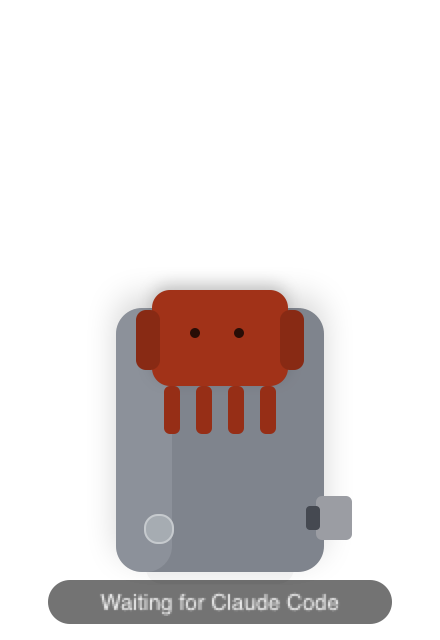
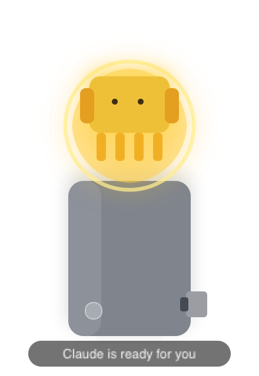

# Claw Jump

电子版 `USB-Clawd` / `claw-jump` 原型：当 Claude Code 完成一轮响应后，桌面右下角的小角色会弹跳一下，提醒你回来继续对话。

## 灵感来源

本项目的灵感来源于 [Clawd MiniFax](https://benbyfax.substack.com/p/clawd-minifax)。

## 示例图片

| Claw Idle | Claw Jump Glow |
|-----------|----------------|
|  |  |

现在这版还支持：

1. 跳起时 claw 变成金色，并伴随一圈金光脉冲。
2. 点击 claw，尝试切回最近一次触发事件对应的 Claude Code 终端；在 `Terminal` / `iTerm` 下会优先恢复到具体 tab。
3. 拖拽 claw 调整桌面位置，并记住你的放置点；默认锚在右下角。

## 当前状态

仓库已经实现了 `Phase 1` 的最小骨架：

1. `hooks/claw-jump-stop.sh`
   接 Claude Code `Stop` hook，把事件发给本地代理。
2. `hooks/claw-jump-reset.sh`
   接 `UserPromptSubmit` hook，把桌面角色恢复到 idle。
3. `hooks/claw-jump-notification.sh`
   接 `Notification` hook，在 Claude Code 需要你批准工具调用时也触发跳动。
4. `agent/`
   一个基于 `Objective-C + AppKit` 的轻量常驻代理，监听 `http://127.0.0.1:47653/event`。

## 构建

```bash
cd /Users/alex/coding/claw-jump/agent
make
```

二进制会生成在：

```bash
/Users/alex/coding/claw-jump/agent/.build/claw-jump-agent
```

## 启动代理

```bash
cd /Users/alex/coding/claw-jump/agent
./.build/claw-jump-agent
```

启动后，菜单栏会出现 `CJ`，桌面右下角会有一个低存在感的底座。

当 Claude Code 完成响应，或需要你批准工具调用时：

1. claw 会跳起。
2. 本体会暂时变成金色。
3. 周围会扩散一圈金光，提醒感更强。
4. 你可以直接点击 claw，尝试切回 Claude Code 所在终端。

点击 claw 之后：

1. claw 会立刻恢复原状，不再继续发光。
2. agent 会尽量把最近一次触发事件对应的终端切回前台；在 `Terminal` / `iTerm` 下会优先按具体 `tty` 恢复到那一个 tab/session。
3. 如果没找到终端，会回退为打开最近一次工作的项目目录。

拖拽行为：

1. 按住 claw 或底座可以拖动位置。
2. 位置会被记住。
3. 如果没有拖过，默认还是右下角。

## 本地测试

在另一个终端里执行：

```bash
cd /Users/alex/coding/claw-jump/agent
./.build/claw-jump-agent emit test
./.build/claw-jump-agent emit reset
```

## Claude Code `settings.json` 最新配置

推荐先把项目路径写进环境变量：

```bash
echo 'export CLAW_JUMP_DIR="/Users/alex/coding/claw-jump"' >> ~/.zshrc && source ~/.zshrc
```

然后在 `~/.claude/settings.json` 里这样配。
如果你已经有别的 Claude Code 配置，只需要把下面这段合并到现有 JSON 的 `hooks` 节点里：

```json
{
  "hooks": {
    "Notification": [
      {
        "hooks": [
          {
            "type": "command",
            "command": "bash \"$CLAW_JUMP_DIR/hooks/claw-jump-notification.sh\"",
            "timeout": 3
          }
        ]
      }
    ],
    "UserPromptSubmit": [
      {
        "hooks": [
          {
            "type": "command",
            "command": "bash \"$CLAW_JUMP_DIR/hooks/claw-jump-reset.sh\"",
            "timeout": 3
          }
        ]
      }
    ],
    "Stop": [
      {
        "hooks": [
          {
            "type": "command",
            "command": "bash \"$CLAW_JUMP_DIR/hooks/claw-jump-stop.sh\"",
            "timeout": 3
          }
        ]
      }
    ]
  }
}
```

上面这份是当前仓库对应的最新推荐版：

1. `Stop`
   Claude 完成一轮响应时跳一下。
2. `Notification`
   Claude 需要你批准 Bash、QA tool 或其他工具调用时也跳一下。
3. `UserPromptSubmit`
   你回到终端继续输入后，让 claw 立刻恢复原状。

`Notification` hook 会在两种情况下触发：

1. Claude Code 需要你批准工具调用，例如 Bash、某些 QA / external tool 调用。
2. Claude Code 等你输入超过 60 秒。

当前代理会把 `Notification` 的原始 `message` 显示在桌面气泡里。

## 模拟权限请求测试

代理启动后，可以手动模拟一条“需要批准 Bash”的通知：

```bash
printf '%s' '{"hook_event_name":"Notification","message":"Claude needs your permission to use Bash","session_id":"demo-session","cwd":"'"$CLAW_JUMP_DIR"'"}' | bash "$CLAW_JUMP_DIR/hooks/claw-jump-notification.sh"
```

## 说明

1. 点击 claw 目前是“best effort”聚焦最近一次触发事件对应的终端；`Terminal` 和 `iTerm` 会优先按 hook 记录下来的 `tty` 去恢复具体 tab/session，`WezTerm`、`Warp`、`Ghostty`、`kitty` 仍然先回到对应应用。
2. 如果找不到对应终端，代理会回退到打开最近一次触发事件对应的项目目录。
3. 当前视觉素材是代码绘制的简化版 mascot，没有接入正式 PNG 或 sprite。
4. 当前代理默认监听 `127.0.0.1:47653`。
