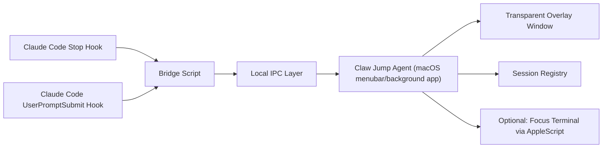
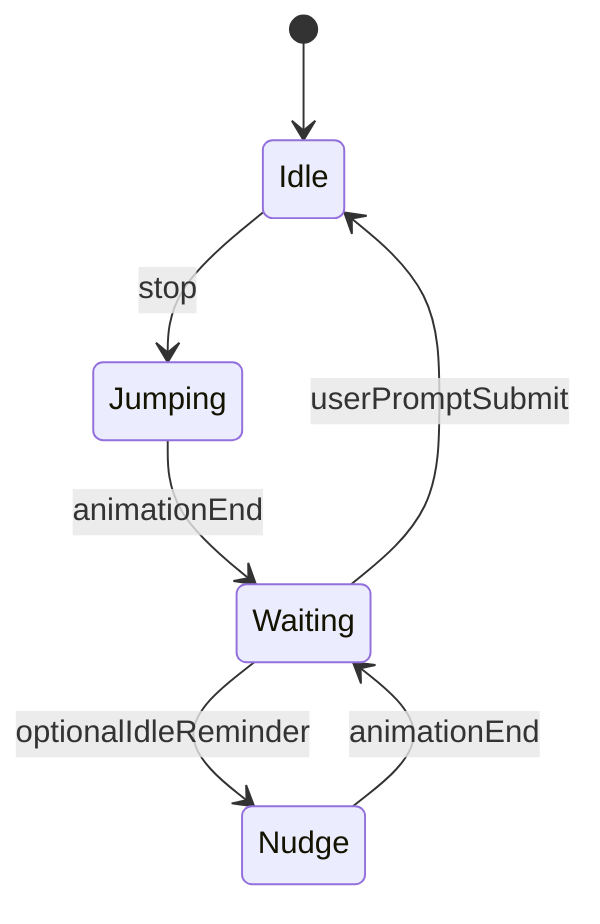

# Claw Jump 设计文档

## 1. 背景

`Claw Jump` 的目标，是把 Ben James 的 USB-Clawd 思路做成一个纯软件、纯桌面的版本：当 Claude Code 完成一轮响应、重新等待用户输入时，桌面上出现一个 Claude 风格的小角色做一次短促的“弹跳”，提醒用户回来继续对话。

Ben 的原始作品把 AI 工作流映射成了一个非常具体的物理反馈：Claude Code 需要用户输入时，桌上的小装置会机械地跳一下。这个项目保留“完成 -> 提醒 -> 回来继续”的核心体验，但把物理执行机构替换成 macOS 桌面动画层。

## 2. 设计目标

### 2.1 产品目标

1. 当 Claude Code 主代理完成响应时，给出一个比系统通知更具存在感、但不刺耳的桌面提示。
2. 视觉反馈要明显借鉴实体 USB-Clawd 的“从底座里弹出”的感觉。
3. 整个链路要足够轻量，不能拖慢 Claude Code 本身。
4. 方案要支持后续扩展，包括多会话、不同角色皮肤、点击回到 Claude Code 等能力。

### 2.2 非目标

1. 第一阶段不追求复杂 3D 渲染。
2. 第一阶段不做跨平台，优先只支持 macOS。
3. 第一阶段不处理所有 Claude 生态产品，只围绕 Claude Code。
4. 第一阶段不把它做成完整的聊天壳层应用，提醒是主功能，恢复会话是辅助功能。

## 3. 用户体验定义

### 3.1 理想体验

1. 用户正在别的窗口里工作。
2. Claude Code 完成当前回答并进入等待输入状态。
3. 屏幕右下角靠近桌面的位置，一个 Claude 风格角色从小底座中弹起，完成一次 0.8 到 1.2 秒的跳跃。
4. 如果用户点击角色，应用尝试把最近一次活跃的 Claude Code 终端窗口切回前台。
5. 如果用户没有理会，动画结束后角色回到静止状态，不持续打扰。

### 3.2 视觉方向

推荐默认形态不是“纯贴图闪现”，而是“底座 + 角色”的组合：

1. 屏幕角落常驻一个很低存在感的银灰色底座，呼应你给的实体照片。
2. Claude 角色平时藏在底座后，只露出少量轮廓，或完全隐藏。
3. 触发时角色垂直弹出，带一点 squash-and-stretch 和落地回弹。
4. 整体更像“桌面小机关”而不是普通通知气泡。

## 4. 触发机制

Claude Code 官方提供 hooks，可以在特定生命周期事件触发命令。这个项目应当优先基于 hooks，而不是轮询日志或截屏识别。

### 4.1 推荐事件

1. `Stop`
   用作主触发源。Claude Code 官方文档说明，`Stop` 会在主代理完成响应时触发；如果是用户手动打断，则不会触发。这最接近“Claude 做完了”的语义。
2. `UserPromptSubmit`
   用于“清空提醒态”。当用户再次输入时，可以让桌面角色收回、停止闪烁或取消未完成动画。
3. `Notification`
   作为可选扩展，不作为第一版主信号。官方文档说明它还会在“等待输入超过 60 秒”或“需要权限”时触发，语义比 `Stop` 更宽，容易带来噪音。
4. `SubagentStop`
   第一版建议不接。否则子代理结束时也会跳，频率可能过高。

### 4.2 基本配置思路

可在 `~/.claude/settings.json` 中注册：

```json
{
  "hooks": {
    "Stop": [
      {
        "hooks": [
          {
            "type": "command",
            "command": "$CLAW_JUMP_DIR/hooks/claw-jump-stop.sh",
            "timeout": 3
          }
        ]
      }
    ],
    "UserPromptSubmit": [
      {
        "hooks": [
          {
            "type": "command",
            "command": "$CLAW_JUMP_DIR/hooks/claw-jump-reset.sh",
            "timeout": 3
          }
        ]
      }
    ]
  }
}
```

这里的脚本不负责动画本身，只负责把事件快速转发给本地常驻桌面代理。

## 5. 推荐技术方案

### 5.1 结论

推荐采用：

1. `Claude Code hooks` 作为事件源
2. `Shell bridge` 作为超轻量转发层
3. `macOS 原生桌面代理` 作为动画执行层
4. `Swift + SwiftUI/AppKit` 作为桌面代理的主要技术栈

### 5.2 为什么优先原生 macOS

相比 Electron/Tauri/Hammerspoon，原生方案更适合这个场景：

1. 更容易创建透明、无边框、浮层级可控的窗口。
2. 动画、窗口层级、点击穿透、开机启动等都更贴近系统能力。
3. 运行时资源占用更小，适合常驻。
4. 后续如果要做“点击回到 iTerm/Terminal”“跟随当前 Space”“Respect Reduce Motion”会更自然。

### 5.3 原型路线

为了加快起步，建议分两段：

1. `MVP 1`
   先用 shell + AppleScript 或一个最小 Swift app，验证 `Stop` 事件能稳定触发动画。
2. `MVP 2`
   再补常驻代理、配置、点击回前台、多会话与皮肤系统。

## 6. 系统架构



### 6.1 模块职责

#### A. Hook 脚本

职责：

1. 读取 Claude Code 通过 stdin 传入的 JSON。
2. 提取 `session_id`、`cwd`、`transcript_path`、`hook_event_name` 等字段。
3. 转换成项目内部统一事件格式。
4. 立刻异步发送给桌面代理，然后快速退出。

约束：

1. 不做复杂逻辑。
2. 不阻塞 Claude Code。
3. 失败也不能影响 Claude 正常结束。

#### B. IPC 层

推荐优先级：

1. 本地 HTTP `localhost`
2. Unix domain socket
3. `launchctl` / `open` 唤起应用

首版建议用本地 HTTP 或 Unix socket，原因是实现简单、调试友好、消息语义清晰。

#### C. Desktop Agent

职责：

1. 常驻后台，监听 hook 事件。
2. 维护最近活跃 Claude Code 会话信息。
3. 对事件做去抖和节流。
4. 控制桌面角色窗口展示、动画、点击行为。
5. 管理用户配置，例如位置、大小、音效、是否常驻底座。

## 7. 事件模型

### 7.1 内部统一事件

建议桥接层统一成如下结构：

```json
{
  "event": "stop",
  "sessionId": "abc123",
  "cwd": "/Users/alex/coding/claw-jump",
  "transcriptPath": "/Users/alex/.claude/projects/...jsonl",
  "timestamp": "2026-04-07T13:45:00+08:00"
}
```

### 7.2 去抖策略

必须避免过于频繁地跳动：

1. 同一 `sessionId` 在 8 到 15 秒内只允许一次完整提醒。
2. 如果连续收到两个 `Stop`，后一个只刷新“未处理提醒状态”，不重复播放完整大动画。
3. 如果在提醒后很快收到 `UserPromptSubmit`，则立即回到 idle 状态。

### 7.3 状态机



说明：

1. `Idle` 表示没有未处理提醒。
2. `Jumping` 是主动画阶段。
3. `Waiting` 表示 Claude 已完成，用户还没回来。
4. `Nudge` 是可选的二次轻提醒，不建议首版启用。

## 8. 桌面表现设计

### 8.1 窗口形态

推荐使用一个透明、无边框、阴影可控的小窗口，而不是系统通知中心卡片。

关键要求：

1. 背景透明。
2. 默认出现在右下角，避开 Dock。
3. 支持“始终显示在当前 Space”。
4. 默认可点击，但避免抢键盘焦点。
5. 如果系统开启“减少动态效果”，自动降级为轻微位移或淡入。

### 8.2 动画语言

推荐动作：

1. 初始隐藏在底座里。
2. 垂直上冲 40 到 80 像素。
3. 顶点轻微停顿 80 到 120 毫秒。
4. 落下后出现 1 次小回弹。
5. 可选地叠加地面阴影收缩和恢复。

建议节奏：

1. 主跳跃总时长 900 毫秒左右。
2. 如果用户 30 秒内仍未回来，可选一次“轻点头”或“小幅弹跳”。
3. 不做无限循环，避免从提醒变成打扰。

### 8.3 点击行为

首版优先级：

1. 点击角色 -> 尝试激活最近一次使用 Claude Code 的终端应用窗口。
2. 如果无法聚焦窗口 -> 打开一个简短菜单，至少允许“复制 transcript 路径”“打开项目目录”“测试跳动”。
3. 长按或右键 -> 打开设置面板。

## 9. 回到 Claude Code 的方案

这是一个实现上容易踩坑、但体验价值很高的点。

### 9.1 推荐策略

1. 桌面代理保存最近一次触发事件对应的 `cwd` 和 `sessionId`。
2. Hook 首次触发时，额外记录当前终端环境信息，例如 `TERM_PROGRAM`。
3. 点击角色时：
   1. 优先尝试把最近活跃的 `iTerm` 或 `Terminal` 窗口置前。
   2. 如果找不到明确窗口，则回退为打开项目目录。
   3. 更进一步的增强版，可以执行 `claude --resume` 或项目约定的 resume 命令。

### 9.2 风险

1. 精确定位“哪一个 Claude Code 窗口”并不稳定，因为 hook 侧并不天然提供窗口句柄。
2. AppleScript 聚焦终端可能需要辅助功能权限。
3. 不同用户使用的终端不同，行为要做适配。

因此第一版建议把“点击回前台”定义为增强特性，而不是阻塞 MVP 的前置条件。

## 10. 资源与素材

### 10.1 角色素材建议

首版优先用 2D 素材，而不是 3D 实时渲染：

1. 一张静态角色 PNG
2. 一张底座 PNG
3. 或 4 到 8 帧的 sprite sheet

这样能最快验证体验。等机制稳定后，再考虑：

1. Blender 导出的序列帧
2. SceneKit / SpriteKit 动画
3. 不同角色皮肤

### 10.2 品牌与替代方案

如果不直接使用 Claude 官方形象，可以做一个“橙色块状小兽”的原创近似风格角色，既保留灵感，也降低素材限制。

## 11. 仓库结构建议

当前仓库是空的，推荐从下面的结构开始：

```text
docs/
  claw-jump-design.md
hooks/
  claw-jump-stop.sh
  claw-jump-reset.sh
agent/
  ClawJumpAgent.xcodeproj
  Sources/
shared/
  event-schema.json
assets/
  mascot/
  pedestal/
```

如果后续不想直接进 Xcode 工程，也可以先做成：

```text
agent/
  Package.swift
  Sources/
```

用 Swift Package 管理核心逻辑，再把 GUI 壳层接上去。

## 12. MVP 分阶段

### Phase 1: 打通链路

目标：

1. Claude Code `Stop` hook 触发本地脚本。
2. 本地脚本成功通知桌面代理。
3. 桌面代理能在屏幕角落显示一个简单图像并上下移动一次。

验收标准：

1. 单次完成响应后，3 秒内一定看到桌面角色跳一下。
2. Claude Code 自身不被明显拖慢。

### Phase 2: 做出“底座弹跳感”

目标：

1. 加入底座与更像实体装置的动画。
2. 增加 idle / waiting / reset 状态切换。
3. 完成基础节流和去抖。

验收标准：

1. 连续对话中不会疯狂连跳。
2. 用户能明显分辨“Claude 已完成”和“普通通知”。

### Phase 3: 可点击回流

目标：

1. 点击角色尝试切回终端。
2. 增加基础设置项。
3. 提供“测试跳动”按钮。

验收标准：

1. 常见环境下可切回 iTerm 或 Terminal。
2. 聚焦失败时有明确 fallback。

### Phase 4: 打磨与扩展

目标：

1. 自定义皮肤、音效、位置。
2. 支持多会话指示。
3. 支持更丰富的提醒模式。

## 13. 风险与规避

### 13.1 Hook 阻塞 Claude Code

风险：

1. 如果 hook 做太多事，可能拖慢 Claude 停止流程。

规避：

1. hook 只做序列化和快速投递。
2. 桌面代理常驻，不在 hook 内启动重型逻辑。

### 13.2 动画层级不符合“桌面感”

风险：

1. 真正放在桌面层会被普通窗口遮住。
2. 放在浮层又可能显得像悬浮窗。

规避：

1. 默认采用低侵入浮层，优先确保“能看到”。
2. 后续再增加“仅桌面模式”作为实验选项。

### 13.3 多会话噪音

风险：

1. 多个 Claude Code 会话可能同时完成，造成提醒风暴。

规避：

1. 维护最近活跃会话优先级。
2. 合并短时间内的多个 `Stop` 为一次提醒。

### 13.4 聚焦终端失败

风险：

1. 不同终端、不同权限设置下聚焦行为差异很大。

规避：

1. 聚焦失败不影响主提醒流程。
2. 设置清晰 fallback，例如打开项目目录。

## 14. 推荐的第一实现版本

如果目标是最快做出可用版本，建议按下面的技术切片开始：

1. 一个 `Stop` hook 脚本
2. 一个本地 Swift 常驻代理
3. 一个透明小窗
4. 一张角色图和一张底座图
5. 一次固定弹跳动画

不要在第一版同时做：

1. 多会话可视化
2. 复杂皮肤系统
3. 3D 模型
4. 精准恢复到某个特定 Claude 会话

## 15. 开放问题

1. 角色素材是直接使用 Claude 风格形象，还是做一个更原创的“Claw Jump mascot”？
2. 提醒是否需要声音，默认应当开启还是关闭？
3. 角色是常驻右下角底座，还是只在触发时出现？
4. 点击后是“聚焦终端”优先，还是“打开 Claude 命令”优先？
5. 是否要支持 Codex、Claude Code 之外的其他 agent 工具，形成统一提醒层？

## 16. 下一步建议

建议紧接着做两件事：

1. 先实现 `Phase 1`，验证 Claude Code `Stop` hook -> 本地代理 -> 桌面跳动 这条最短链路。
2. 在链路跑通后，再根据你更喜欢“桌面常驻小机关”还是“只在完成时弹出”的感觉，定视觉稿和交互细节。

## 17. 参考资料

1. Ben James, “USB-Clawd and a Mini Fax Machine”  
   <https://benbyfax.substack.com/p/clawd-minifax>
2. Anthropic, “Hooks reference”  
   <https://docs.anthropic.com/en/docs/claude-code/hooks>
3. Anthropic, “Get started with Claude Code hooks”  
   <https://docs.anthropic.com/en/docs/claude-code/hooks-guide>
